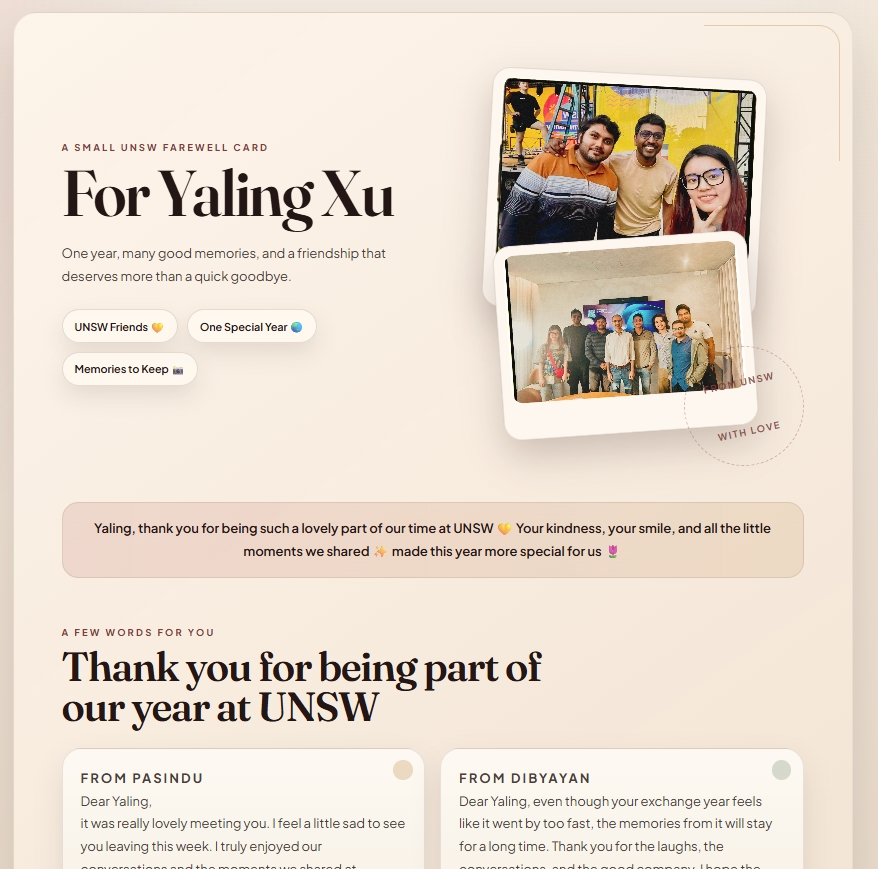

# Yaling Farewell Card

This is a static farewell card for Yaling Xu. It is ready to open locally and ready to publish on GitHub Pages.

## Preview

## Files

- `index.html`: page content
- `styles.css`: design and layout
- `script.js`: small reveal animation
- `Images/`: the two photos used in the card

## Local preview

Open `index.html` in a browser.

## Publish on GitHub Pages

1. Create a new GitHub repository.
2. Upload these files to the repository root.
3. Make sure the default branch is named `main`.
4. In GitHub, open `Settings` -> `Pages`.
5. Under `Build and deployment`, set `Source` to `GitHub Actions`.
6. Push to `main`.
7. Wait for the `Deploy GitHub Pages` workflow to finish.
8. Your card will be live at:

`https://maninka123.github.io/Digital_gift_card/`

## Suggested repo name

`Digital_gift_card`

## Updating the messages later

Edit the text in `index.html`, commit, and push again. GitHub Pages will redeploy automatically.
