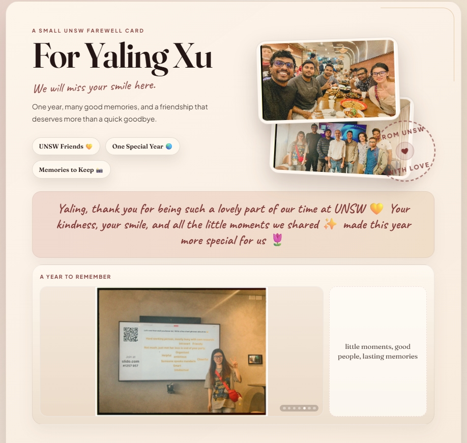

# Yaling Farewell Card

A small digital farewell card for Yaling Xu, made by friends at UNSW.

## Preview



## Live site

`https://maninka123.github.io/Digital_gift_card/`

## Local preview

Open `index.html` in a browser, or run:

```powershell
python -m http.server 8000
```

Then open `http://localhost:8000/`

## Project structure

- `index.html`: page content
- `styles.css`: layout and visual design
- `script.js`: reveal effects and rotating memory images
- `Images/`: photos used by the card and README preview

## Updating the messages later

Edit `index.html`, commit the change, and push to `main`. GitHub Pages will update the live site automatically.
